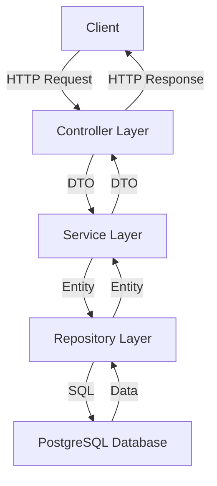

# Game Information System Architecture

This document outlines the architecture for a CRUD application to manage video game information using Spring Boot and PostgreSQL.

## System Overview

The system will allow users to:
- Create new game information records
- Retrieve game information (individual games or lists)
- Update existing game information
- Delete game information

## Architecture Components

### 1. Database Layer
- PostgreSQL database running in Docker
- Single table for game information

### 2. Application Layers
- **Entity Layer**: Java POJOs representing database tables
- **Repository Layer**: Spring Data JPA interfaces for database operations
- **Service Layer**: Business logic implementation
- **Controller Layer**: REST API endpoints
- **DTO Layer**: Data Transfer Objects for API requests/responses

## Database Schema

### GameInfo Table
| Column Name | Data Type | Constraints | Description |
|-------------|-----------|-------------|-------------|
| id | BIGINT | PRIMARY KEY, AUTO INCREMENT | Unique identifier |
| name | VARCHAR(255) | NOT NULL | Name of the game |
| release_date | DATE | | Release date of the game |
| system | VARCHAR(100) | NOT NULL | Gaming system/platform |
| owned | BOOLEAN | NOT NULL, DEFAULT false | Whether the user owns the game |
| has_backup | BOOLEAN | NOT NULL, DEFAULT false | Whether the user has a backup copy |
| created_at | TIMESTAMP | NOT NULL | Record creation timestamp |
| updated_at | TIMESTAMP | NOT NULL | Record update timestamp |

## Project Structure

```
com.owngames.demo/
├── config/                  # Configuration classes
│   └── DatabaseConfig.java  # Database configuration
├── model/                   # Entity classes
│   └── GameInfo.java        # Game information entity
├── repository/              # Repository interfaces
│   └── GameInfoRepository.java
├── service/                 # Service layer
│   ├── GameInfoService.java      # Service interface
│   └── GameInfoServiceImpl.java  # Service implementation
├── controller/              # REST controllers
│   └── GameInfoController.java   # Game info API endpoints
├── dto/                     # Data Transfer Objects
│   ├── GameInfoRequestDto.java   # Request DTO
│   └── GameInfoResponseDto.java  # Response DTO
├── exception/               # Custom exceptions
│   ├── ResourceNotFoundException.java
│   └── GlobalExceptionHandler.java
└── DemoApplication.java     # Main application class
```

## API Endpoints

### Game Information API

| Method | Endpoint | Description |
|--------|----------|-------------|
| GET | /api/games | Get all games |
| GET | /api/games/{id} | Get game by ID |
| POST | /api/games | Create new game |
| PUT | /api/games/{id} | Update game by ID |
| DELETE | /api/games/{id} | Delete game by ID |
| GET | /api/games/search | Search games by criteria |

## Docker Configuration

The application will use Docker Compose to set up:
1. PostgreSQL database container
2. Application container (optional)

## Implementation Flow Diagram



## Security Considerations

- Input validation for all API endpoints
- Error handling with appropriate HTTP status codes
- Database connection security