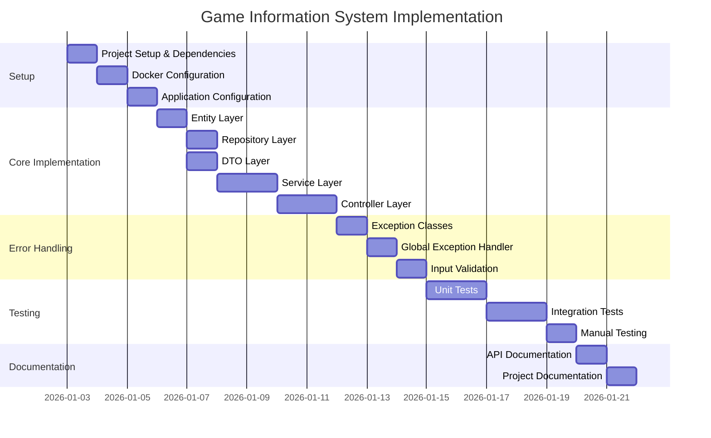
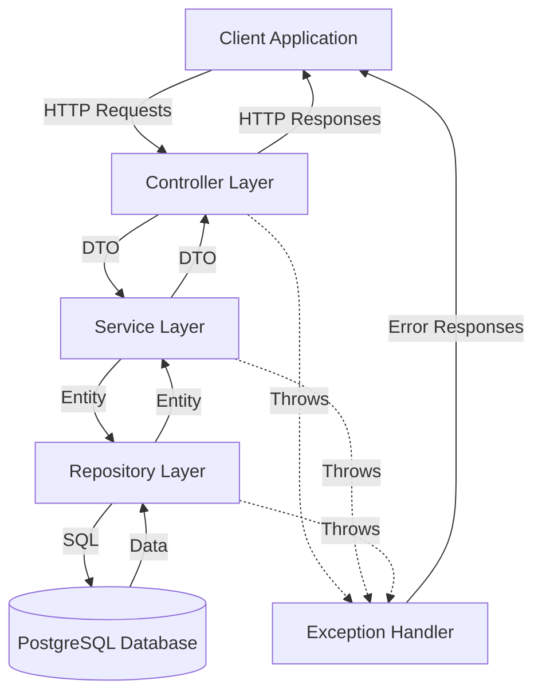

# Game Information System Implementation Roadmap

This document provides a comprehensive roadmap for implementing the Game Information System, bringing together all the components described in the other planning documents.

## System Overview

The Game Information System is a Spring Boot application that provides CRUD operations for managing video game information. It uses PostgreSQL running in Docker for data storage and exposes a REST API for client interaction.

## Implementation Phases

### Phase 1: Project Setup and Configuration

1. **Update Dependencies**
   - Add PostgreSQL driver to pom.xml
   - Add validation dependencies
   - Add Swagger/OpenAPI for documentation

2. **Docker Setup**
   - Create docker-compose.yml file
   - Configure PostgreSQL container
   - Test database connection

3. **Application Configuration**
   - Configure database connection in application.properties
   - Set up JPA/Hibernate properties
   - Configure server and API documentation settings

### Phase 2: Core Implementation

4. **Entity Layer**
   - Create GameInfo entity with all required fields
   - Add JPA annotations for database mapping
   - Implement Lombok annotations for boilerplate code reduction

5. **Repository Layer**
   - Create GameInfoRepository interface
   - Define custom query methods
   - Implement search functionality

6. **DTO Layer**
   - Create request and response DTOs
   - Add validation annotations
   - Implement conversion methods

7. **Service Layer**
   - Define service interface
   - Implement service methods
   - Add business logic and validation

8. **Controller Layer**
   - Create REST controller
   - Define API endpoints
   - Add OpenAPI documentation
   - Implement request handling

### Phase 3: Error Handling and Validation

9. **Exception Handling**
   - Create custom exceptions
   - Implement global exception handler
   - Define error response structures

10. **Input Validation**
    - Add validation annotations to DTOs
    - Implement validation logic in service layer
    - Handle validation errors in controllers

### Phase 4: Testing

11. **Unit Testing**
    - Test repository methods
    - Test service layer logic
    - Test controller endpoints

12. **Integration Testing**
    - Test complete CRUD flow
    - Test error handling
    - Test validation logic

13. **Manual Testing**
    - Verify API functionality with tools like Postman
    - Test edge cases and error scenarios

### Phase 5: Documentation and Finalization

14. **API Documentation**
    - Configure Swagger/OpenAPI
    - Document all endpoints
    - Provide usage examples

15. **Project Documentation**
    - Update README.md with setup instructions
    - Document architecture and design decisions
    - Create user guide

## Implementation Timeline



## Component Relationships



## Directory Structure

```
com.owngames.demo/
├── config/
│   └── DatabaseConfig.java
├── model/
│   └── GameInfo.java
├── repository/
│   └── GameInfoRepository.java
├── service/
│   ├── GameInfoService.java
│   └── GameInfoServiceImpl.java
├── controller/
│   └── GameInfoController.java
├── dto/
│   ├── GameInfoRequestDto.java
│   └── GameInfoResponseDto.java
├── exception/
│   ├── ResourceNotFoundException.java
│   └── GlobalExceptionHandler.java
└── DemoApplication.java
```

## Key Files to Create

1. **Docker Configuration**
   - `docker-compose.yml`

2. **Application Configuration**
   - `src/main/resources/application.properties`

3. **Entity Model**
   - `src/main/java/com/owngames/demo/model/GameInfo.java`

4. **Repository Interface**
   - `src/main/java/com/owngames/demo/repository/GameInfoRepository.java`

5. **DTOs**
   - `src/main/java/com/owngames/demo/dto/GameInfoRequestDto.java`
   - `src/main/java/com/owngames/demo/dto/GameInfoResponseDto.java`

6. **Service Layer**
   - `src/main/java/com/owngames/demo/service/GameInfoService.java`
   - `src/main/java/com/owngames/demo/service/GameInfoServiceImpl.java`

7. **Controller**
   - `src/main/java/com/owngames/demo/controller/GameInfoController.java`

8. **Exception Handling**
   - `src/main/java/com/owngames/demo/exception/ResourceNotFoundException.java`
   - `src/main/java/com/owngames/demo/exception/GlobalExceptionHandler.java`

9. **Test Configuration**
   - `src/test/resources/application-test.properties`

## Next Steps

1. Begin by setting up the Docker environment and configuring the database connection
2. Implement the entity model and repository layer
3. Build the service and controller layers
4. Add validation and error handling
5. Write tests for all components
6. Document the API and finalize the project

## Conclusion

This roadmap provides a structured approach to implementing the Game Information System. By following these steps, you'll create a robust, well-tested application that meets all the requirements for managing game information.