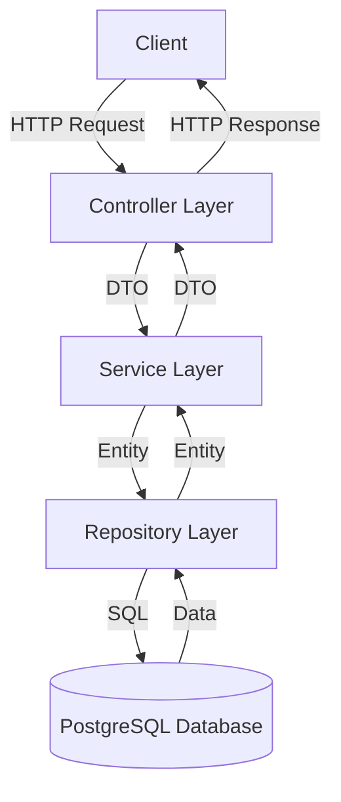

# Game Information System - Project Summary

## Project Overview

The Game Information System is a Spring Boot application designed to help you manage your video game collection. It provides a complete CRUD (Create, Read, Update, Delete) interface for storing and retrieving information about games you own, including details such as:

- Game name
- Release date
- Gaming system/platform
- Ownership status
- Backup status

The system uses PostgreSQL running in Docker for data storage and exposes a RESTful API for client interaction.

## Architecture Summary

The application follows a standard layered architecture:

### Key Components

1. **Database Layer**: PostgreSQL database running in Docker
2. **Entity Layer**: JPA entities representing database tables
3. **Repository Layer**: Spring Data JPA interfaces for database operations
4. **Service Layer**: Business logic implementation
5. **Controller Layer**: REST API endpoints
6. **DTO Layer**: Data Transfer Objects for API requests/responses
7. **Exception Layer**: Custom exceptions and global error handling

## Documentation Overview

We've created a comprehensive set of documentation to guide the implementation:

1. **[Architecture Overview](architecture.md)**: Detailed description of the system architecture, including database schema, component relationships, and API endpoints.

2. **[Implementation Plan](implementation_plan.md)**: Step-by-step guide for implementing each component of the system, including code examples.

3. **[Docker Setup Guide](docker_setup.md)**: Instructions for setting up and using Docker for the PostgreSQL database.

4. **[Testing Strategy](testing_strategy.md)**: Comprehensive testing approach, including unit tests, integration tests, and test configuration.

5. **[Implementation Roadmap](implementation_roadmap.md)**: Timeline and sequence for implementing the various components of the system.

6. **[README](README.md)**: Project overview, setup instructions, and usage examples.

## Implementation Steps

The implementation is organized into the following phases:

### Phase 1: Project Setup and Configuration
- Update project dependencies
- Set up Docker and PostgreSQL
- Configure application properties

### Phase 2: Core Implementation
- Create entity model
- Implement repository layer
- Create DTOs
- Implement service layer
- Develop controller layer

### Phase 3: Error Handling and Validation
- Create custom exceptions
- Implement global exception handler
- Add input validation

### Phase 4: Testing
- Write unit tests
- Create integration tests
- Perform manual testing

### Phase 5: Documentation and Finalization
- Document API with Swagger/OpenAPI
- Update project documentation
- Final testing and review

## Next Steps

To begin implementing the Game Information System:

1. Start by setting up the Docker environment using the instructions in the [Docker Setup Guide](docker_setup.md)
2. Update the project dependencies as outlined in the [Implementation Plan](implementation_plan.md)
3. Configure the application properties for database connection
4. Follow the step-by-step implementation guide to build each component of the system

## Conclusion

This project provides a solid foundation for managing your video game collection. The architecture is designed to be scalable and maintainable, with clear separation of concerns between the different layers. The comprehensive documentation will guide you through the implementation process, ensuring a successful outcome.

By following the implementation plan and roadmap, you'll create a robust, well-tested application that meets all the requirements for managing game information.